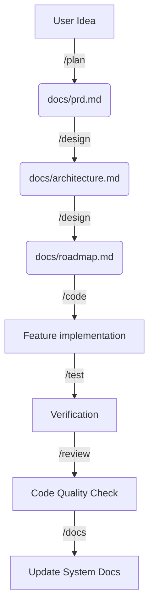

# ⚡ Claude Overdrive

<div align="center">
  <h3>The Ultimate "Brain Kit" for Claude Code CLI</h3>
  <p><b>700+ Specialized Skills. 20+ Automated Workflows. 100% Autonomous Software Engineering.</b></p>

  [](https://github.com/lequochungs/claude-overdrive/stargazers)
  [](https://github.com/lequochungs/claude-overdrive/network/members)
  [](https://opensource.org/licenses/MIT)
  [](https://anthropic.com/claude)
</div>

---

**Claude Overdrive** is a high-performance system extension for Anthropic's [Claude Code](https://claude.ai/code) CLI. It transforms your local AI into a **Senior Autonomous Software Engineer** by injecting specialized Standard Operating Procedures (SOPs) directly into its decision-making loop.

> [!IMPORTANT]
> **Why Overdrive?** While standard AI assistants *write code*, Claude Overdrive *engineers systems*. It follows a strict document-driven process that ensures security, scalability, and zero technical debt.

---

## ⚔️ Legacy AI vs. ⚡ Claude Overdrive

| Feature | Regular Claude Code | ⚡ Claude Overdrive |
|:---|:---:|:---:|
| **Mindset** | Reactive Assistant | Proactive Architect |
| **Logic** | Ad-hoc Chatting | Document-Driven SOP |
| **Toolbox** | Standard CLI Tools | 700+ Specialized Skills |
| **Process** | Code -> Debug | Plan -> Design -> Code -> Test |
| **MVP Speed** | Hours | Minutes (`/cook`) |

---

## 🛠️ Prerequisites

Before you power up, ensure you have:
1.  **Node.js** (v18+).
2.  **Claude Code CLI**: `npm install -g @anthropic-ai/claude-code`.
3.  **Git**: Required for the injector.

---

## 📦 Rapid Injection

Use the "One-Line Injector" to transform any directory into an Overdrive workspace.

### 🚀 Method 1: The NPX Injector (Fastest)
```bash
npx github:lequochungs/claude-overdrive
```

### 🛰️ Method 2: The One-Line CURL
```bash
curl -sSL https://raw.githubusercontent.com/lequochungs/claude-overdrive/main/install.sh | bash
```

### ⚙️ Method 3: Post-Injection Setup
Always finalize your installation to optimize the brain for your local environment:
```bash
sh .claude/setup.sh
```

---

## 🔄 The Document-Driven Workflow

Overdrive moves your project through a structured pipeline. Each phase produces a "Truth Document" that guides the next phase.



---

## 🚀 Real-World Example: Idea to MVP in 3 Minutes

Imagine building a **SaaS Boilerplate with Stripe & Analytics** from scratch.

### 1. The Setup
```bash
mkdir my-dream-startup && cd my-dream-startup
npx github:lequochungs/claude-overdrive
```

### 2. The Ignite
Start **Claude Code** and run:
```text
/init
/cook "Build a SaaS boilerplate with Next.js, Stripe integration, and User Analytics."
```

### 3. The Result
**Claude Overdrive will then automatically:**
1.  **Plan**: Draft a PRD with security-first auth logic and subscription tiers.
2.  **Design**: Create a micro-architecture and a 20-point Roadmap.
3.  **Implement**: Build the database schema, API routes, and UI components.
4.  **Verify**: Run unit tests and perform a deep 🔍 `/review` for N+1 query safety.

---

## 🧠 700+ Specialized Skills
The `.claude/skills/` library provides deep knowledge across:
- **Cloud & DevOps**: AWS, K8s, Docker, Terraform patterns.
- **Security**: XSS prevention, JWT hardening, SQLi audits.
- **Frontend**: Shadcn/UI, Framer Motion, Accessibility (A11y).
- **Backend**: Redis, PostgreSQL, Microservices, Webhooks.

---

## 🌟 Support the Project

If this kit saves you hours of development time, please consider:
- 🌟 **Starring** the repository on GitHub.
- 🔱 **Forking** it to add your custom skills.
- 📢 **Sharing** it with fellow developers.

---

Built with ❤️ by [lequochungs](https://github.com/lequochungs).  
*Transforming Ideas into Software, Automatically.*
